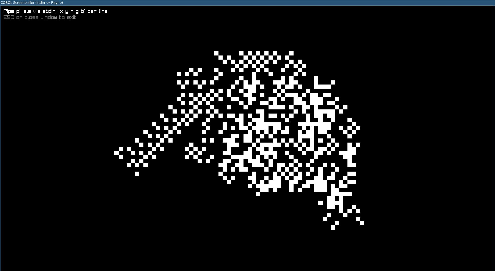

# cbol-gwaphics

Tiny "graphics" experiments in GnuCOBOL by printing pixel commands to stdout, plus a Rust viewer (`screenbuf`) that displays those pixels in a window.

The core idea: your COBOL program prints lines like:

```
x y r g b
```

and the viewer treats them as pixel updates on a `64x64` framebuffer.

## Screenshot



## Quickstart

### Prereqs

- GnuCOBOL (`cobc`) on your PATH
- Rust toolchain (`cargo`)
- Raylib build requirements (used by `screenbuf` via the `raylib` crate). If `cargo build` fails, install raylib and its dev headers for your OS.

### Run a demo

Terminal 1: build and launch the viewer (creates `target/screenbuf.pipe` and opens a window):

```bash
./launch_screenbuf.sh
```

Terminal 2: compile a COBOL program and stream its output into the pipe:

```bash
./run_cobol.sh src/MAIN.cob
# or:
./run_cobol.sh src/ANT.cob
```

If you just want "one command" glue, use:

```bash
./run_demo.sh
```

## How It Works

- `screenbuf` (Rust) opens a window and reads newline-delimited pixel commands from `stdin`.
- COBOL programs call the `GRAPHICS` subprogram (`src/GRAPHICS.cbl`), which emits pixel lines using `DISPLAY`.
- `launch_screenbuf.sh` creates a named pipe at `target/screenbuf.pipe`, tails it, and forwards bytes into `screenbuf`.
- `run_cobol.sh` compiles a given COBOL program with any `*.cbl` subprograms in the same directory, then writes its stdout into the named pipe.

## Protocol (stdin -> screenbuf)

One command per line, whitespace-separated:

```
x y r g b
```

- `x`, `y`: zero-based coordinates (`0 <= x < 64`, `0 <= y < 64`)
- `r`, `g`, `b`: 0-255 color channels (alpha is forced to 255)

Out-of-bounds pixels are ignored by the viewer.

## COBOL Drawing API

The copybook `src/GFXARGS.cpy` defines a tiny "opcode + params" struct that you pass to:

```cobol
CALL 'GRAPHICS' USING GFX-ARGS
```

Supported opcodes:

- `CLR `: clear the whole buffer to black
- `FILL`: fill the whole buffer with the current RGB color
- `RECT`: draw a filled rectangle
- `LINE`: draw a line (Bresenham)
- `CIRC`: draw a circle (midpoint)

The logical framebuffer size lives in `src/SETTINGS.cpy` (`WIDTH`, `HEIGHT`), currently `64x64`.

## Troubleshooting

- `X11: Failed to open display` / `Failed to initialize GLFW`: you are running without a GUI session. Run under a desktop session with X11/Wayland, or configure `DISPLAY`/forwarding appropriately.

## Repo Layout

- `src/`: COBOL programs and subprograms
  - `src/GRAPHICS.cbl`: emits pixels for shapes
  - `src/MAIN.cob`, `src/BOUNCYBALLS.cob`, `src/ANT.cob`: demos/experiments
- `screenbuf/`: Rust viewer (Raylib window + pixel buffer)
- `launch_screenbuf.sh`: builds/launches viewer and sets up the named pipe
- `run_cobol.sh`: compiles a COBOL source and streams output to the pipe
- `run_demo.sh`: convenience wrapper that runs both

## License

GPL-3.0 (see `LICENSE`).
